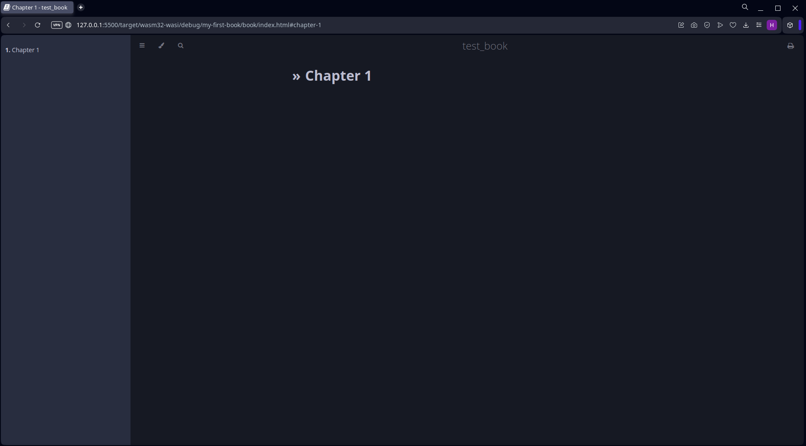

# Wasi mdbook demo

## Abstract

In this project, I developed a project, that creates a web-pages similar to Rust book. In this solution, I used the wasi target for creating the book.

I used the `mdBook` crate for creating a web book pages. 

For creating the wasm binary, I used commands:

1. First
```bash
rustup target add wasm32-wasi
```
2. Second
```bash
cargo build --target wasm32-wasi --no-default-features --features search,watch
```

## How to run

1. Install [Wasmer](https://wasmer.io)
2. Move to folder with a book
```bash
cd ./target/wasm32-wasi/debug/my-first-book
```
3. Create a book using wasmer
```bash
wasmer --dir . ../mdbook.wasm 
```
4. Open the created html file in your browser

## Example

Here is an example of the created book:


